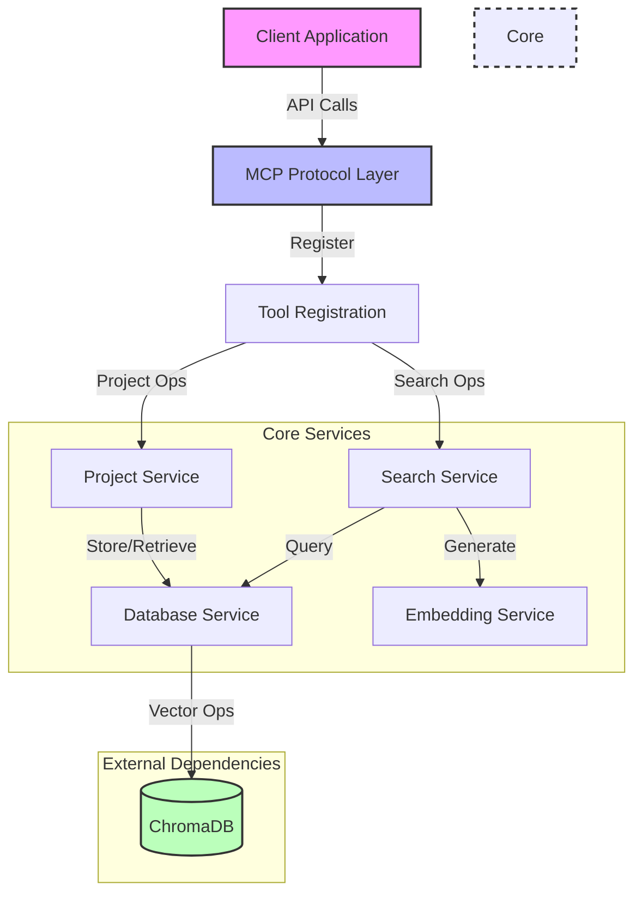
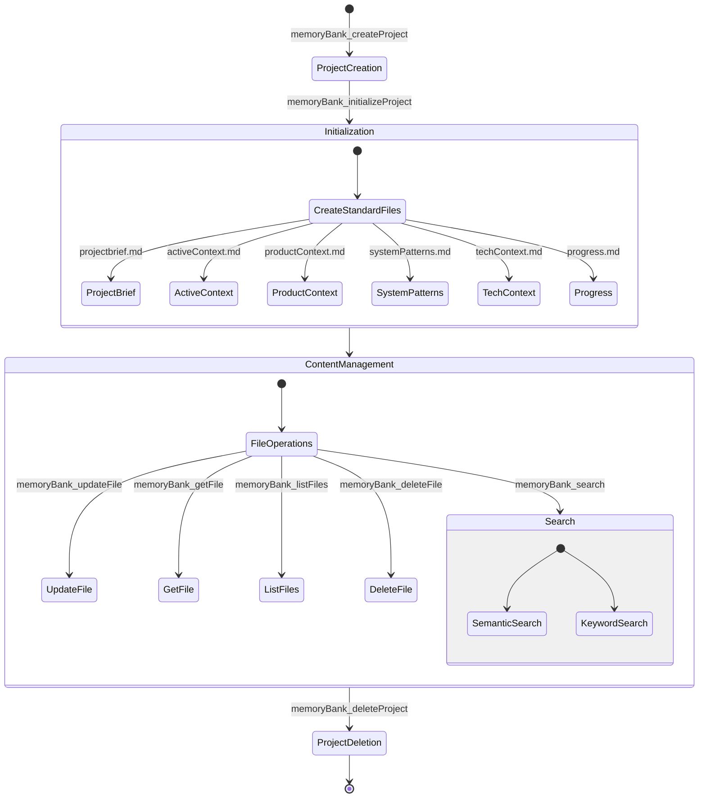

# MCP Memory Bank Server 🧠

A powerful, context management system for Large Language Models (LLMs). Built with ChromaDB and modern embedding technologies, it provides persistent, project-specific memory capabilities that enhance your AI's understanding and response quality.

## ✨ Key Features

- 🚀 **High Performance**: Optimized vector storage with ChromaDB
- 🔒 **Project Isolation**: Separate context spaces for different projects
- 🔍 **Smart Search**: Both semantic and keyword-based search capabilities
- 🔄 **Real-time Updates**: Dynamic content management with automatic chunking
- 🎯 **Precise Recall**: Advanced embedding generation via @xenova/transformers
- 🐳 **Easy Deployment**: Docker-ready with persistent storage

## 🏗️ System Architecture



## 🚀 Quick Start

### Prerequisites

- Node.js (v18+ LTS recommended)
- npm (v9+ recommended)
- Docker Desktop (latest stable)
- 2GB+ free RAM
- 1GB+ free disk space

### One-Command Setup

```bash
# Clone, install, and run in development mode
git clone https://github.com/your-org/mcp-memory-bank.git && cd mcp-memory-bank && npm install && docker-compose up -d && npm run dev
```

## 🔄 Project Lifecycle



## 📚 API Documentation

### Core Tools

#### Project Management

- `memoryBank_createProject`: Create isolated project spaces
- `memoryBank_initializeProject`: Create standard Memory Bank files in a project
- `memoryBank_deleteProject`: Clean up project data
- `memoryBank_listProjects`: View all projects
- `memoryBank_getProjectByName`: Fetch project details

#### Content Management

- `memoryBank_updateFile`: Store/update content with auto-chunking
- `memoryBank_getFile`: Retrieve full content
- `memoryBank_listFiles`: View stored files
- `memoryBank_deleteFile`: Remove content
- `memoryBank_search`: Semantic/keyword search

## 🔧 Configuration

### Environment Variables

```env
CHROMADB_URL=http://localhost:8000
MCP_MEMBANK_EMBEDDING_MODEL=Xenova/all-MiniLM-L6-v2
```

## 🐛 Troubleshooting

### Common Issues

1. **ChromaDB Connection Failed**

   ```bash
   # Check if container is running
   docker ps | grep chroma
   # Restart if needed
   docker-compose restart
   ```

2. **Memory Issues**
   - Ensure Docker has sufficient memory allocation
   - Consider reducing batch sizes in heavy operations

## 🤝 Contributing

1. Fork the repository
2. Create your feature branch (`git checkout -b feature/AmazingFeature`)
3. Commit your changes (`git commit -m 'Add some AmazingFeature'`)
4. Push to the branch (`git push origin feature/AmazingFeature`)
5. Open a Pull Request

## 📈 Performance Considerations

- Vector operations scale with embedding dimensions
- Batch operations for better throughput
- Use appropriate chunk sizes (default: 512 tokens)
- Consider index optimization for large datasets

## 📄 License

This project is licensed under the MIT License - see the [LICENSE](LICENSE) file for details.

---
Built with ❤️ by the bsmi021
